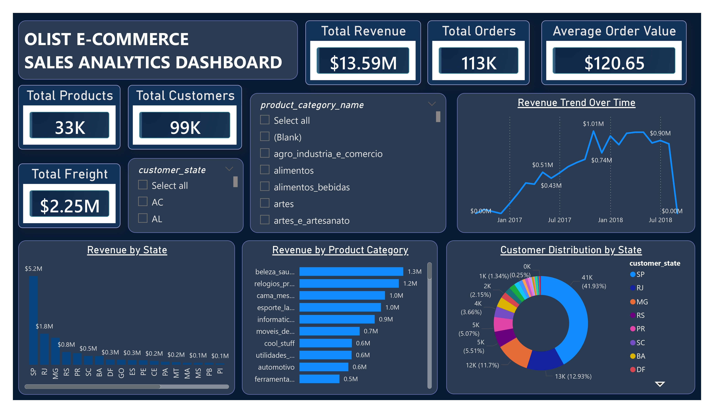
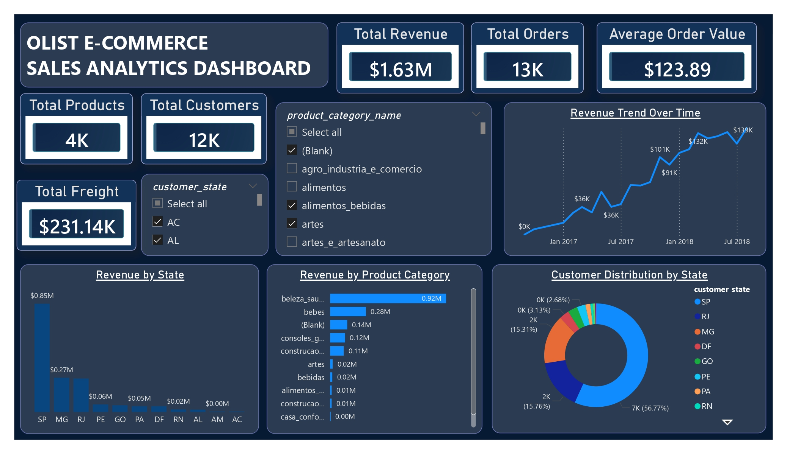
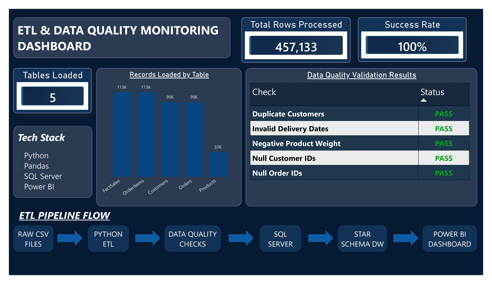
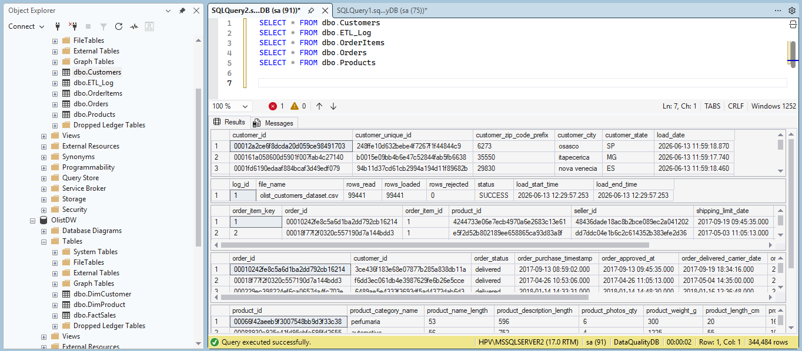

# Python ETL & Data Quality Framework

End-to-End Data Engineering Project using Python, SQL Server, Data Quality Validation, Star Schema Data Warehouse, and Power BI Dashboards.


---

# Project Overview

This project demonstrates a complete Data Engineering workflow built using Python, SQL Server, and Power BI.

The pipeline extracts raw e-commerce datasets, performs data quality validation, loads data into SQL Server, builds a Star Schema Data Warehouse, and creates interactive dashboards for business analysis and ETL monitoring.

---

# Architecture

```text
Raw CSV Files
      ↓
Python ETL Pipeline
      ↓
Data Quality Validation
      ↓
SQL Server Staging Database
      ↓
Star Schema Data Warehouse
      ↓
Power BI Dashboards
```

---

# Dataset

Dataset: Olist Brazilian E-Commerce Dataset

### Source Files

* olist_customers_dataset.csv
* olist_orders_dataset.csv
* olist_order_items_dataset.csv
* olist_products_dataset.csv

---

# Data Quality Checks

The framework validates data before loading:

✅ Null Customer ID Detection

✅ Null Order ID Detection

✅ Duplicate Record Detection

✅ Invalid Delivery Date Detection

✅ Product Data Validation

✅ ETL Load Monitoring

---

# ETL Processing Summary

| Table      | Records |
| ---------- | ------: |
| Customers  |  99,441 |
| Orders     |  99,441 |
| OrderItems | 112,650 |
| Products   |  32,951 |
| FactSales  | 112,650 |

### Total Records Processed

457,133+

---

# Data Warehouse Design

## Dimension Tables

### DimCustomer

* customer_key
* customer_id
* customer_city
* customer_state
* customer_zip_code_prefix

### DimProduct

* product_key
* product_id
* product_category_name
* product_weight_g

---

## Fact Table

### FactSales

* sales_key
* customer_key
* product_key
* sales_amount
* freight_value
* order_date

---

# Dashboard 1 — Sales Analytics Dashboard

### Features

* Total Revenue Analysis
* Total Orders Analysis
* Average Order Value
* Revenue Trend Analysis
* Revenue by State
* Revenue by Product Category
* Customer Distribution Analysis
* Interactive Filtering

### Dashboard Overview



### Dashboard with Filters Applied



---

# Dashboard 2 — ETL & Data Quality Monitoring

### Features

* Total Rows Processed
* Tables Loaded
* Success Rate Monitoring
* Data Quality Validation Results
* ETL Pipeline Flow
* Technology Stack Overview

### Dashboard Overview



---

# SQL Server Objects

### Data Warehouse Tables

* DimCustomer
* DimProduct
* FactSales

### SQL Validation



---

# ETL Logging

The framework captures ETL execution information including:

* Rows Read
* Rows Loaded
* Load Status
* ETL Monitoring

Log File:

```text
logs/etl_log.csv
```

---

# Project Structure

```text
Python-ETL-DataQuality-Framework
│
├── data
│   ├── raw
│   ├── processed
│   └── rejected
│
├── dashboard
│   └── dashboard1.pbix
│
├── logs
│   └── etl_log.csv
│
├── screenshots
│   ├── dashboard1_overview.png
│   ├── dashboard1_filtered.png
│   ├── dashboard2_etl_monitoring.png
│   ├── sql_tables.png
│   └── data_quality_report.png
│
├── scripts
│
├── sql
│
└── README.md
```

---

# Technology Stack

* Python
* Pandas
* SQLAlchemy
* SQL Server
* Power BI
* Data Warehousing
* ETL Development
* Data Quality Validation

---

# Skills Demonstrated

* ETL Pipeline Development
* Data Cleaning & Validation
* SQL Server Database Design
* Star Schema Modeling
* Data Warehousing
* Data Quality Monitoring
* Business Intelligence
* Dashboard Development
* Data Analytics

---

# Key Achievements

✔ Built a complete ETL Framework using Python

✔ Processed 457K+ records

✔ Implemented automated Data Quality Validation

✔ Designed a Star Schema Data Warehouse

✔ Developed interactive Power BI dashboards

✔ Implemented ETL Monitoring and Logging

✔ Integrated SQL Server with Power BI


